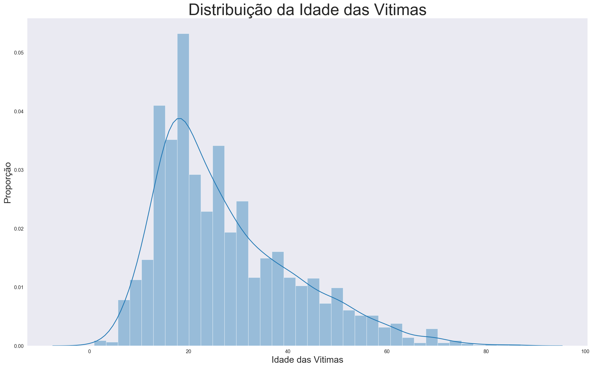
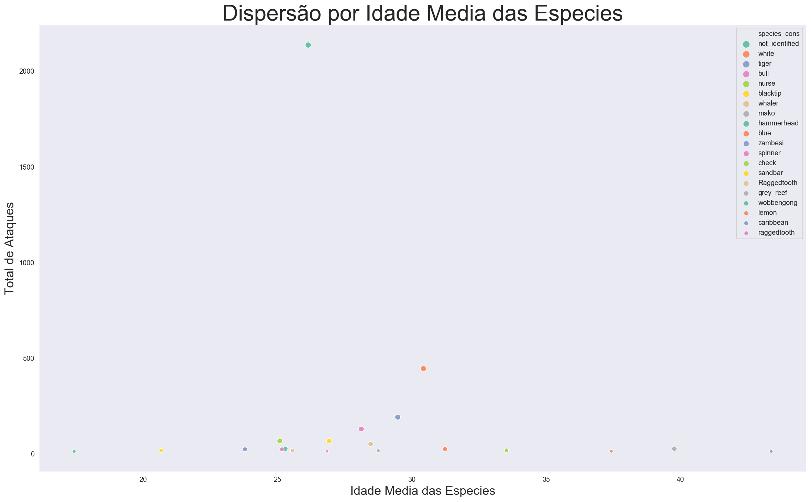
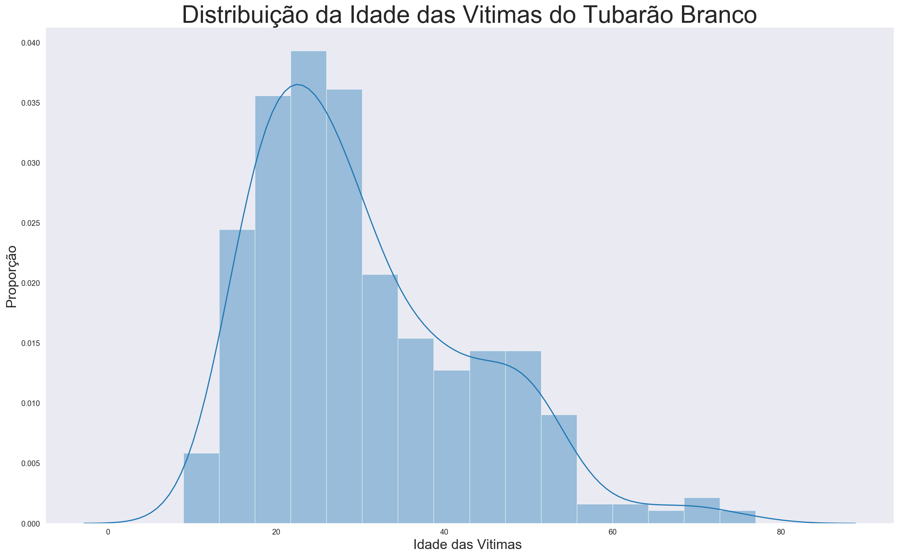
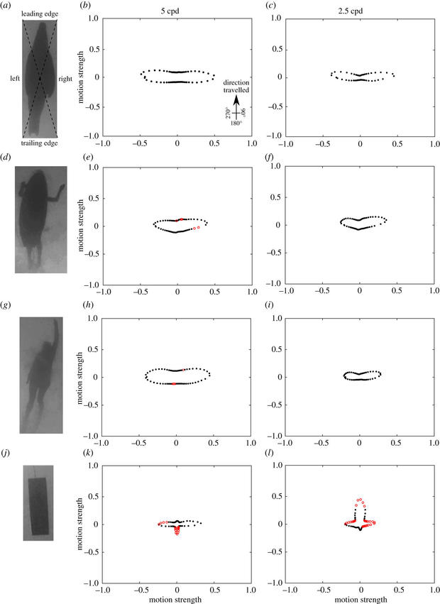

# Shark Attack

My focus on this project were to clean the dataset that came from Kaggle, based on research by  https://www.sharkattackfile.net/index.htm
During my job, I tryied to answer the following question: 

* Which age group  do white shark like to attack?

White Shark belongs to Family Lamnidae - Mackerel Sharks and your scientifc name is  *Carcharodon carcharias*

- gill openings large, barely extending onto the top of the head
- teeth enlarged, blade-like, and relatively few — less than 40 rows in each jaw
- gill rakers absent
- tail stalk slender, with precaudal pits and strong lateral keels
- caudal fin nearly symmetrical, with lower lobe almost as long as the upper
- coastal and oceanic; cool temperate to tropical zones of the Atlantic, Pacific, and Indian oceans


## Getting Started

I started seeing the file and I could see that there were many problems on it. The first all, the duplicated line were about 67,5% of all lines. The names of collumns were hard to work, totally messed. 

## Cleanning was a hard hard work!

### What I did to Cleanup

  * Delete empyt collumns and no useful information on DataFrame
  * Investigating collumn age, lacked and messed information on that 
  * Fixing age with a dictionary, too many conditions to deal on that
  * Creating a new collum called "new_age"
  * Creating a Function for mapping Age collum and assigned the right value to new_age
  * Some cases were marked as "check" in new_age, after were deleted and new_age was converted to int64 type
  * Regognizing species on DataFrame, based on print, was created an excel file to fix
  * Based on excel file of scpecies, was created a new DataFrame
  * Merging both to create a new one called "tb_sharkattack_new"

### Start point of analisys

  Export the DataFrame to tb_sharkattack_new.csv. Is was sufficient to my job. 

## The Analysis 

During the process of identify age groups and others information regarding to it, many graphs were created, but I am going to focus on the main subject. 

### White shark attack like young, child, old people? 

Just to clarify one important problem on this dataset  is that many attacks don´t have the species identified, that means 64%.  
Let´s see those identifed on table bellow:

```
white	  13.440048
tiger	  5.798852
bull	  3.926306
nurse	  2.053760
blacktip  2.023558
whaler	  1.540320
mako	  0.815464

````
so, when you see the attacks whith species identified, you see white shark on the top, but represent only 13,44%


#### Let´s see better this number for white shark 




The graph above is not a normal curve, but its similar to that. We can infer that mean is between 20's 

Let´s use mean to consolidate the age. This indicator of central tendecy works well when you don´t have outliers.  
look into dataset you can see that age mean for white shark attacks is 30,4 years, differente from 27,4 years for all dataset. 
Let´s remember that all other cases that species weren´t idendtify represent 64% of data and mean of age for those is 26 years. 


Let´s see the distribution per species on the following graph 



The attacks are concentrated in 20`s, but white shark is the red on above others.  

Now, let´s see the same distribution curve for white shark :



 It´s not so different from that for all, but there on  right tail is little change. 

To better undersdanting, the dataset was cut in 10 pieces of age group. I don´t see any consesus about group age from other sources, so thought  it would be a good 
idea to create this groups 
Let´s see how many attacks happend in each group age by white shark 

```
(9.6, 18.2]	    0.162528
(18.2, 26.8]	0.311512
(26.8, 35.4]	0.221219
(35.4, 44.0]	0.133183
(44.0, 52.6]	0.119639
(52.6, 61.2]	0.027088
(0.914, 9.6]	0.002257
(61.2, 69.8]	0.011287
(69.8, 78.4]	0.011287
(78.4, 87.0]	0.000000
```

As you can see the attacks happen majoritly  between 18 and 44 years. 


Let´s see  for all cases: 

```

0	(9.6, 18.2]	    0.277258
1	(18.2, 26.8]	0.266385
2	(26.8, 35.4]	0.178496
3	(35.4, 44.0]	0.112353
4	(44.0, 52.6]	0.070069
5	(52.6, 61.2]	0.040169
6	(0.914, 9.6]	0.032619
7	(61.2, 69.8]	0.014799
8	(69.8, 78.4]	0.006342
9	(78.4, 87.0]	0.001510

```
Hum!? Change a little, isn´t?  it seems like white shark attack less childrem! Is it true!?


### Let´s check the activities envolved in those attacks by white shark 

Maybe, knowing what people are doing it´s possible to know your age. Maybe?

```
surfing               159
diving                81
swimming              60
fishing               58
body                  24
Snorkeling            12
Kayaking              10
Treading water        6
standing              6
Lifesaving drill      2
SUP                   2

```
More than 50% of people were surfing, diving, fishing  or  swimming when were attacked by white shark. 

What about others  activities for all dataset?

```
surfing             887
swimming            693
fishing             503
diving              301
wading              143

```
Its seems like diving has relevancy to white skark attack more then other types. 
For white shark it is 18% of attacks and for all is 9%


Let´s see group age for those activities an their proportions: 

```
	group Age	prop_surfing	    prop_swimming	 prop_diving	prop_fishing
(9.6, 18.2]	    0.296505	        0.347763	     0.116279	    0.139165
(18.2, 26.8]	0.311161	        0.264069	     0.229236	    0.274354
(26.8, 35.4]	0.174746	        0.124098	     0.292359	    0.270378
(35.4, 44.0]	0.109357	        0.075036	     0.162791	    0.153082
(44.0, 52.6]	0.063134	        0.067821	     0.116279	    0.089463
(52.6, 61.2]	0.027057	        0.046176	     0.056478	    0.045726
(0.914, 9.6]	0.011274	        0.044733	     0.006645	    0.005964
(61.2, 69.8]	0.005637	        0.020202	     0.016611	    0.007952
(69.8, 78.4]	0.001127	        0.007215	     0.003322	    0.011928
(78.4, 87.0]	0.000000	        0.002886	     0.000000	    0.001988

```


### Correlation vs Causation
Even though, the mean of age say that white shark prefer a group of age, people between 18 an 44 years, that are doing surfing, swimmin, diving and fish, it´s not meaning that they want to attack them. Surfing and diving are sports that brings some risk of atttack and  diving has a mean of age greater than others activities. According to article on site https://observador.pt/2021/10/29/novo-estudo-explica-razao-pela-qual-tubaroes-atacam-humanos/, humans are attacked by shark when they "think" humans are their natural food. like seals, turtle and other animals that lives on ocean. So sharks don´t hunt humans, and even less chose group of age. They attack from bottom to up, than  someone surfing or diving can be attacked. Diving bring the risk when envolves fishing. Shark can smell far from  hundreds meters the fresh meet or blood of fishes. The probality to be attacked by shark is minimal, according to Insitute of Australian Science bettween 1970 and 2000 died 12 people caused by shark while died 150 hit by coconut. So be carrefull with coconut tree on beach more than sharks.  


"...leading researchers to believe that the sharks' ability to differentiate between humans and prey is actually worse because of the lower visibility in oceans. They also believe that the mistaken identity theory could apply to other shark species associated with human fatalities, such as tiger sharks or bull sharks. (https://www.cbsnews.com/news/great-white-sharks-bite-humans-mistaken-identity/)


Look the pattern




In many cases, the white shark were identified by witness and researches whit bite pattern and tooth fragments , even though thats be a hard task even to biologist to say which species can be involved, according to article on http://www.elasmo-research.org/education/white_shark/patterns.htm. The white shark attack from bottom to surface, but the victims by themselves  couldn´t identify the species and say white shark. 


## Conclusion

On this study, we can see a lot of attacks to main activities like surfing, swiming and fishing. There no evidence that if you have 30's, you are the next victim of shark. Clearly, people doing these activities are more exposed. I believe age mean for diving has impacted mean age for white shark, but doesn´t mean that they prefer one than others. When shark attack a human, feel that is not your food and  doesn´t eat. it thinks, it´s disgudting!

Other problem is Availability *bias* can change our perceptions of risk and maybe of researcher when identified as predator, very famous on the movies.  In fact that species need be keep protect against illegal fishing and others human activities. 


